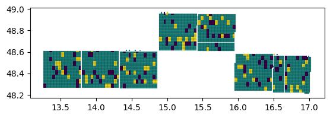

# Label Experiments

The first task is to set up a set of label packages that mix FTW labels
with Lacuna labels in varying formats. Some of the factors to consider
are discussed in issue
[\#1](https://github.com/agroimpacts/ftw-mappingafrica-integration/issues/1),
and we will sketch them out here in more detail.
<a href="#tbl-labelsets" class="quarto-xref">Table 1</a> describes the
band combination sets, but not the training/validation/test subsets to
compose from each.

Table 1: Label combinations

| Set | Bands |
|----|----|
| \#1 | FTW single time point & Lacuna+ (Planet) |
| \#2 | FTW single time point & Lacuna+ (S2 upsample) |
| \#3 | FTW double time point & Lacuna+ (Planet dry/S2 upsample wet) |
| \#4 | FTW double time point & Lacuna+ (S2 upsample dry/wet) |
| \#5 | FTW single time point & Lacuna+ (Planet), both with DEM derivatives |
| \#6 | FTW double time point & Lacuna+ (Planet dry/S2 upsample wet), both with DEM derivatives |
| \#7 | FTW double time point & Lacuna+ (S2 upsample dry/wet), both with DEM derivatives |

Those are the main combinations to start. Numbers 1 is the primary and
will be the focus of initial work. Numbers 2-4 are next. Numbers 5-7 are
possibilities.

Additional variants might include:

- Using the S2 super-resolution model to do the upsampling of all S2
  variants

- Using temporal features instead of a second time point, e.g. NDVI
  amplitudes

Lacuna labels have been resized to 256x256 to match existing FTW
dimensions, and will be normalized using local across band based on
prior experiments.

## Experiments

### Validation/Test Sets

From FTW, use the validation/test splits internal to each country,
e.g. from Austria:

And from Lacuna labels we can use the existing splits from our catalog
(typically higher quality labels across the full set of countries). We
will create two test sets for countries where final models will be
assessed at scale, with the second set used for focused in-country
evaluation.

- Proposed Lacuna+ countries:

  - Zambia
  - Ghana
  - South Africa
  - Tanzania

- FTW countries:

  - Slovenia
  - France
  - South Africa

This gives then three general sets of test labels:

- FTW region-wide
- Lacuna+ region-wide
- Lacuna+ specific countries
- FTW validation countries

### Design

#### Models

- FTW’s baseline (U-Net with EfficientNet backbone)
- Torchgeo-based U-Net closest to [Khallaghi et al
  (2025)](https://www.mdpi.com/2072-4292/17/3/474) variant

#### Experiments

| Train         | Finetune          | Evaluate          |
|---------------|-------------------|-------------------|
| FTW           |                   | Lacuna+ test      |
| FTW           | Lacuna+           | Lacuna+ test      |
| Lacuna+       |                   | FTW test          |
| Lacuna+       | FTW               | FTW test          |
| FTW + Lacuna+ |                   | FTW test          |
| FTW + Lacuna+ | FTW               | FTW test          |
| FTW + Lacuna+ |                   | Lacuna+           |
| FTW + Lacuna+ | Lacuna+           | Lacuna+           |
| FTW + Lacuna+ |                   | FTW countries     |
| FTW + Lacuna+ | FTW countries     | FTW countries     |
| FTW + Lacuna+ |                   | Lacuna+ countries |
| FTW + Lacuna+ | Lacuna+ countries | Lacuna+ countries |

List of proposed experiments. Experiments without a fine-tuning set
represent direct transfers to the evaluation dataset {#tbl-experiments}.

These general experiments to be repeated for the key datasets listed in
<a href="#tbl-labelsets" class="quarto-xref">Table 1</a>.
